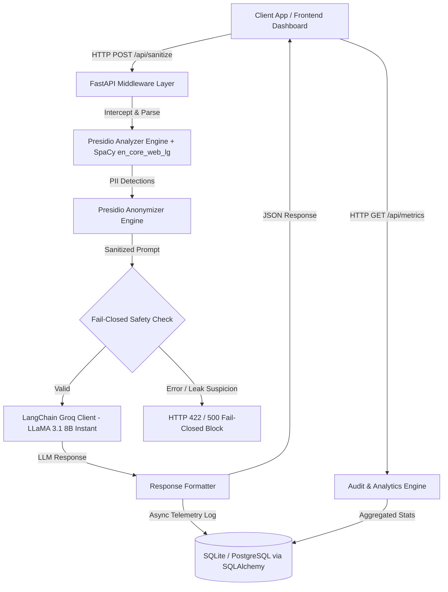

# Technical Requirements Document (TRD)

**Project:** Enterprise PII Security Middleware (MVP)  
**Status:** Approved for Development  

---

## 1. System Architecture



---

## 2. Technical Stack

| Layer | Technology | Purpose |
| :--- | :--- | :--- |
| **API Framework** | FastAPI (Python 3.10+) | High-throughput asynchronous REST API |
| **PII Detection** | Microsoft Presidio Analyzer + SpaCy | Multi-entity NLP recognition |
| **PII Anonymization** | Microsoft Presidio Anonymizer | Mathematical redaction with `<ENTITY_TYPE>` tokens |
| **LLM Inference** | LangChain Groq (`ChatGroq`) | Ultra-fast token generation (`llama-3.1-8b-instant`) |
| **Database & ORM** | SQLAlchemy 2.0 + Alembic (SQLite/Postgres) | Zero-PII audit logging and threat telemetry |
| **Configuration** | Pydantic Settings + python-dotenv | 12-factor environment management |
| **Frontend UI** | React 18 + Vite + Tailwind CSS / Vanilla CSS | Real-time threat visualizer & audit monitoring |

---

## 3. Data Privacy & Zero-PII Policy

### Prohibited Data Persistence
The following items **MUST NEVER** be stored in logs, databases, or cache layers:
1. `raw_text` / Unsanitized prompt
2. Extracted PII values (e.g. actual email strings, credit card numbers, personal names)
3. Direct identifiers correlating sensitive prompts to individuals

### Allowed Telemetry Schema (`audit_logs`)
| Column | Type | Description |
| :--- | :--- | :--- |
| `id` | Integer (Primary Key) | Unique audit record ID |
| `timestamp` | DateTime (UTC) | Event generation timestamp |
| `threats_intercepted` | Integer | Total count of PII entities blocked |
| `detected_entity_types` | JSON / String | Array of entity labels (e.g. `["EMAIL_ADDRESS", "PERSON"]`) |
| `sanitized_prompt_preview` | String (Truncated) | Safe anonymized text preview |
| `latency_ms` | Float | Total end-to-end processing time in milliseconds |
| `status` | String | `SUCCESS` or `FAILED_BLOCKED` |

---

## 4. API Endpoints Specification

### 1. `POST /api/sanitize`
* **Request Body:**
  ```json
  {
    "user_prompt": "Send the invoice to john.doe@acme.corp or call +1-555-0199."
  }
  ```
* **Response Body (200 OK):**
  ```json
  {
    "status": "success",
    "original_prompt": "Send the invoice to john.doe@acme.corp or call +1-555-0199.",
    "sanitized_prompt": "Send the invoice to <EMAIL_ADDRESS> or call <PHONE_NUMBER>.",
    "llm_response": "I have noted the contact instructions.",
    "threats_intercepted": 2,
    "detected_entities": [
      { "entity_type": "EMAIL_ADDRESS", "start": 20, "end": 42, "score": 1.0 },
      { "entity_type": "PHONE_NUMBER", "start": 51, "end": 64, "score": 0.85 }
    ],
    "latency_ms": 142.5
  }
  ```

### 2. `GET /api/metrics`
* Returns aggregated counts of threats intercepted, entity breakdown distributions, and SLA metrics.

### 3. `GET /api/audit-logs`
* Returns the most recent 50 zero-PII audit telemetry records.

### 4. `GET /api/health`
* Returns engine operational status and configured model provider.

---

## 5. Security & SLA Guardrails

1. **Fail-Closed Principle:** If the analyzer throws an uncaught exception, return an HTTP error and abort the LLM call immediately.
2. **Sub-second SLA:** Total processing time `< 1000ms`.
3. **CORS Enabled:** Cross-Origin Resource Sharing configured for secure local frontend consumption.
